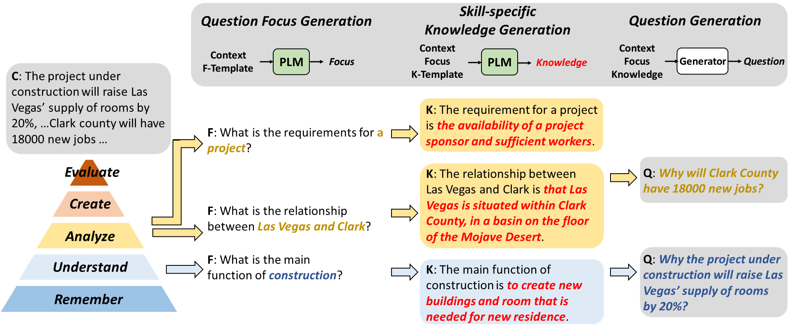

# SkillQG
This repository is the official implementation of the ACL 2023 paper (Findings)
[SkillQG: Learning to Generate Question for Reading Comprehension Assessment](https://arxiv.org/abs/2305.04737)

<div style="text-align: center;">
    
    <p><big><strong>and</strong></big></p>
    
</div>

## Abstract
We present SkillQG: a question generation framework with controllable comprehension types for assessing and improving machine reading comprehension models. Existing question generation systems widely differentiate questions by literal information such as question words and answer types to generate semantically relevant questions for a given context. However, they rarely consider the comprehension nature of questions, i.e. the different comprehension capabilities embodied by different questions. In comparison, our SkillQG is able to tailor a fine-grained assessment and improvement to the capabilities of question-answering models built on it. Specifically, we first frame the comprehension type of questions based on a hierarchical skill-based schema, then formulate SkillQG as a skill-conditioned question generator. Furthermore, to improve the controllability of generation, we augment the input text with question focus and skill-specific knowledge, which are constructed by iteratively prompting the pre-trained language models. Empirical results demonstrate that SkillQG outperforms baselines in terms of quality, relevance, and skill-controllability while showing a promising performance boost in the downstream question-answering task.

## Prerequisites

```bash
pip install -r requirements.txt
```

## Run specification for SkillQG

### Template design based on Bloom's Taxonomy

- We provide the generic templates in `/promptpackage/fairytaleqa_bloom_prompt.json`, which contains several pairs of `F-template` and `K-template`.
	- `F-template` is used to discover possible question focuses with either shape of the following two templates:
		- **prefix template** will be filled by the PLM and we employ the generated tokens as the generated question focus. For example, `What is the definition of <blank>` and `What happened as a result of <blank>`.
		- **cloze-style template** leaves blanks in the middle part of the input prompt, which we substitute with entities and regard as the question focus. For example, `What will <blank> want to do next?` and `What will happen to <blank> next?`.
	- `K-template` is engaged to generate skill-related knowledge based on the context and question focuses and with the shape of **prefix template**. For example, `The definition of <focus> is <blank>` and `If <focus>, the output will be <blank>`.

### Data pre-processing and skill mappings

- Download [FairytaleQA dataset](https://github.com/uci-soe/FairytaleQAData) and save the subdirectory `data-by-train-split` into the project.

- Convert the samples of the FairytaleQA dataset from `CSV` to `JSON` format, that is,

	```python
	{
		"qid": {
			"context": "",
			"question": "",
			"answer": "",
			"reasoning skill": []
		}
	}
	```

	- We provide an alternative script in the `data` sub-package of `skillqgpackage` package, i.e. `skillqgpackage.data.FairytaleQADataset.FairytaleQASeq2SeqLMDataset.parse_and_build()`, to finish this kind of format conversion. In addition to parsing the necessary fields, the script merges the sections involved in the question-answer pair into the final context text and discards other sections, which are extracted by the `corr_sec` field in the FairytaleQA dataset.

- Map the question type annotations of the FairytaleQA dataset to our defined skill-based schema, i.e. `REMEMBER`, `UNDERSTAND`, `ANALYZE`, `CREATE`, and `EVALUATE`.

| Annotation | Count | Percentage (%) | Skill |
| :---: | :---: | :---: | :---: |
| Character | 1172 | 11.08 | REMEMBER |
| Setting | 630 | 5.95 | REMEMBER |
| Action | 3342 | 31.59 | UNDERSTAND |
| Feeling | 1024 | 9.68 | EVALUATE |
| Causal rel. | 2940 | 27.79 | ANALYZE |
| Outcome res. | 986 | 9.42 | ANALYZE |
| Prediction | 486 | 4.59 | CREATE |

### Knowledge externalization through chain-of-thought prompting

- Specify the aforementioned template filename and JSON dataset directory name, and run the script `generate_knowledge_from_lm.py` in `promptpackage`, which will employ the [GPT2](https://cdn.openai.com/better-language-models/language_models_are_unsupervised_multitask_learners.pdf) English model as the default knowledge source.

```bash
python generate_knowledge_from_lm.py
```

- This script will save generated question focuses and knowledge text as a sub-directory dubbed as `lm-augmented-json` in the same parent directory as the JSON dataset directory, that is, the final directory of FairtaleQA dataset is like:

```bash
FairytaleQAData/
├── data-by-origin/
├── data-by-train-split/
├── json/
│   ├── test.json
│   ├── train.json
│   └── val.json
├── lm-augmented-json/
│   ├── test.json
│   ├── train.json
│   └── val.json
├── starter.py
└── story_meta.csv
```

- The augmented JSON sample is like this:

```python
{
	"qid": {
		"context": "",
		"question": "",
		"answer": "",
		"reasoning skill": "",
		"prompt-#n": {
			"question": "",
			"answers": []
		}
	}
}
```

### Skill-conditioned BART generator
- Configure format
	- We follow the widely-used hierarchical configuration paradigm using the [YAML](https://en.wikipedia.org/wiki/YAML) (a human-readable data-serialization mark language) file format.
	- Run the following script to create a default configuration file.

	```bash
	cd configure/
	python default.py
	```

    - Adapt the specific items (or key-value pairs) according to your requirements. We have provided seven typical configurations in the `configure` directory.


- Train then test

```bash
python source/main.py --cfg path/to/configure
```

- Automatic evaluation

```bash
python source/evaluate.py --cfg path/to/configure
```

- Human evaluation
	- Question content
	- Skill-controllability
	- Knowledge quality

- Downstream QA evaluation
	- Employ the generated candidate questions to augment the exsiting train split of FairytaleQA dataset.
	- Train a Distil-BERT QA model on the augmented datasets.
	- Evaluate the QA performance under both resource-sufficient and -deficient settings.

## License
Copyright 2023 author of this paper

Permission is hereby granted, free of charge, to any person obtaining a copy of this software and associated documentation files (the "Software"), to deal in the Software without restriction, including without limitation the rights to use, copy, modify, merge, publish, distribute, sublicense, and/or sell copies of the Software, and to permit persons to whom the Software is furnished to do so, subject to the following conditions:

The above copyright notice and this permission notice shall be included in all copies or substantial portions of the Software.

THE SOFTWARE IS PROVIDED "AS IS", WITHOUT WARRANTY OF ANY KIND, EXPRESS OR IMPLIED, INCLUDING BUT NOT LIMITED TO THE WARRANTIES OF MERCHANTABILITY, FITNESS FOR A PARTICULAR PURPOSE, AND NONINFRINGEMENT. IN NO EVENT SHALL THE AUTHORS OR COPYRIGHT HOLDERS BE LIABLE FOR ANY CLAIM, DAMAGES, OR OTHER LIABILITY, WHETHER IN AN ACTION OF CONTRACT, TORT, OR OTHERWISE, ARISING FROM, OUT OF, OR IN CONNECTION WITH THE SOFTWARE OR THE USE OR OTHER DEALINGS IN THE SOFTWARE.

## Citation

```latex
@article{wang2023skillqg,
  title={SkillQG: Learning to Generate Question for Reading Comprehension Assessment},
  author={Wang, Xiaoqiang and Liu, Bang and Tang, Siliang and Wu, Lingfei},
  journal={arXiv preprint arXiv:2305.04737},
  year={2023}
}
```
